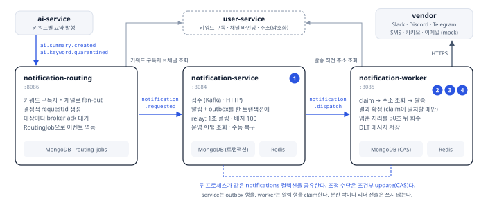
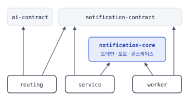
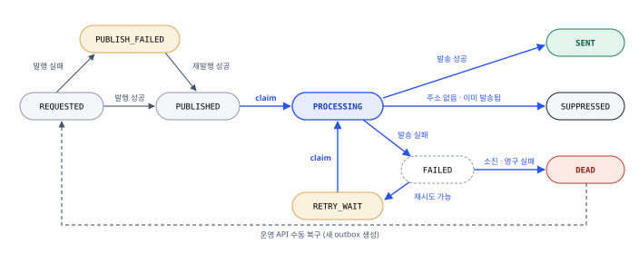
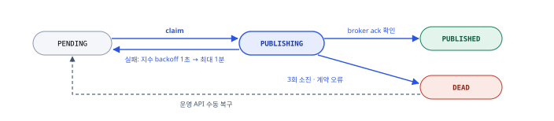

# Notification
> 요약 이벤트를 구독자에게 **유실 없이, 한 번만** 전달하는 알림 발송 파이프라인

kachi의 notification 컨텍스트를 한곳에서 읽는 문서다. 핵심만 적고, 결정의 배경과 상세 규칙은 링크한 문서가 정본이다.

---

## 1. 개요

### 목표

| 유실 없음 | 사용자에게 한 번만 | 사람 없이 회수 |
| --- | --- | --- |
| 접수된 알림은 저장과 발행 사이 어느 지점에서 죽어도 다시 발행된다 | Kafka 재전달, 리밸런스, worker 장애가 있어도 같은 알림이 두 번 가지 않는다 | 처리 중 멈춘 건은 자동으로 회수하고, 자동으로 못 푸는 건만 운영 API로 넘긴다 |

### 시스템 아키텍처



①~④는 [멱등 가드](#네-층-멱등-가드)의 층 번호다. 발송 채널 중 Slack·Discord·Telegram은 실제 sender, SMS·카카오·이메일은 mock sender다.

### Kafka 토픽

| 토픽 | 발행 | 파티션 키 | 소비 그룹 | 실패하면 |
| --- | --- | --- | --- | --- |
| `ai.summary.created`, `ai.keyword.quarantined` | ai-service | - | `notification-routing` | 1초 간격 3회 뒤 `notification.routing.dlt` |
| `notification.requested` | routing | `requestId` | `notification-service` | 1초 간격 3회 뒤 `notification.requested.dlt` |
| `notification.dispatch` | service relay | `recipientId` | `notification-worker` | 수동 ack. 1초 간격 3회 뒤 `notification.dispatch.dlt` |
| `notification.dispatch.dlt` | worker | 원본 키 | `notification-worker-dlt` | MongoDB 저장이 성공한 뒤에만 ack |

상세문서: [ADR 012](decisions/012-notification-service-초기-모듈-설계.md) · [ADR 027](decisions/027-알림-라우팅.md)

---

## 2. 기술 스택

- Kotlin, Java 21, Spring Boot 4 (WebFlux, Coroutines)
- MongoDB replica set: 알림·outbox·이력·DLT 저장, 다중 문서 트랜잭션
- Redis: 멱등 마커, 수신 주소 캐시
- Kafka: 단계 사이의 전달과 재전달, DLT
- Micrometer, Prometheus, Grafana
- Testcontainers, ArchUnit, UUID v7

---

## 3. 모듈 구조

| 모듈 | 포트 | 책임 |
| --- | --- | --- |
| `notification-contract` | - | Kafka 이벤트 계약 |
| `notification-core` | - | 도메인, inbound·outbound 포트, 유스케이스. Spring에 의존하지 않는다 |
| `notification-routing` | 8086 | 요약 이벤트를 수신자 x 채널 알림 요청으로 fan-out |
| `notification-service` | 8084 | 접수, outbox relay, 운영 API |
| `notification-worker` | 8085 | dispatch 소비, 채널 발송, 회수, DLT 저장 |



의존 방향은 `service → core → contract`, `worker → core → contract`, `routing → contract`다. service와 worker는 adapter와 조립만 갖고, 유스케이스는 저장·발행·선점·발송을 포트로만 본다. 의존 방향과 배치 규칙은 모듈별 ArchUnit 테스트가 검사한다.

상세문서: [ADR 012](decisions/012-notification-service-초기-모듈-설계.md) · [아키텍처](아키텍처.md)

---

## 4. 핵심 설계 요약

### Transactional Outbox

DB 저장과 Kafka 발행은 한 트랜잭션으로 묶이지 않는다. 알림(`REQUESTED`)과 outbox(`PENDING`)를 한 MongoDB 트랜잭션에 기록하고, relay가 행마다 claim해 발행한 뒤 broker ack를 받고 claim이 그대로일 때만 결과를 확정한다. 실패는 지수 backoff(1초~1분)로 3회까지 시도하고, 그 뒤는 `DEAD`로 두어 운영 API로 복구한다. 회수가 만들 수 있는 중복 발행은 worker 쪽 멱등 가드가 흡수한다.

상세문서: [ADR 013](decisions/013-notification-request-service-outbox-dispatch-flow.md) · [ADR 015](decisions/015-notification-outbox-publish-runtime.md) · [ADR 017](decisions/017-mongodb-replica-set-전환과-트랜잭션-전제.md)

### 네 층 멱등 가드

층마다 막는 상황이 다르고 서로를 대신하지 않는다.

| # | 층 | 장치 | 막는 상황 | 못 막는 상황 |
| --- | --- | --- | --- | --- |
| ① | 접수 | Redis SET NX(24시간) + `requestId` unique index | 같은 요청으로 알림이 두 개 생기는 것 | 하나뿐인 알림의 재발송 |
| ② | 소비 | Redis SET NX(5분) + `PROCESSING` claim | 재전달, 리밸런스로 두 worker가 동시에 실행 | 회수 뒤의 재발송 |
| ③ | vendor 키 | 알림마다 고정된 멱등 키(24시간)를 sender에 전달 | 재시도로 같은 요청이 vendor에 두 번 가는 것 | 키를 받지 않는 webhook 채널 |
| ④ | 발송 직전 | `notification:sent:{requestId}` SET NX(24시간) | vendor 호출 뒤 저장 전에 죽어, 회수 후 다시 나가는 것 | 호출 직전에 죽은 한 건은 다시 보내지 않는다 |

조정의 기준은 Redis 마커가 아니라 DB claim이다. 마커는 불필요한 DB 접근을 줄이는 1차 필터다. ④는 중복보다 누락을 택한 결정이다. 같은 알림을 두 번 받는 것은 사용자가 바로 알아채지만, 빠진 한 건은 다음 요약에서 이어진다.

상세문서: [알림 멱등 가드](알림-멱등-가드.md) · [ADR 028](decisions/028-발송-직전-주소-조회와-스킵.md)

### 상태 전이와 처리권

**Notification** (9 states)



파란 선은 조건부 update(CAS)로 지키는 전이, 회색 실선은 발행 결과 반영, 점선은 운영자 조작이다. 종착 상태는 `SENT`, `SUPPRESSED`, `DEAD`다. `FAILED`는 이력만 남기고 같은 저장에서 `RETRY_WAIT`나 `DEAD`로 넘어간다.

**Outbox** (4 states)



처리권을 얻는 전이와 결과를 확정하는 전이는 모두 조건부 update로 한쪽만 통과시킨다.

| 전이 | update가 성립하는 조건 | 어긋나면 |
| --- | --- | --- |
| outbox claim | `_id` + `PENDING` + `nextRetryAt ≤ now` | 다른 relay가 가져간 것. 건너뛴다 |
| outbox 결과 확정 | `_id` + `PUBLISHING` + `claimedAt` + `claimedBy` | 회수된 뒤 도착한 늦은 결과. 버린다 |
| 알림 claim | `_id` + status ∈ {`PUBLISHED`, `RETRY_WAIT`} | 현재 상태를 다시 읽어 재시도 또는 skip |
| 알림 결과 확정 | `_id` + `PROCESSING` + `claimedAt` + `claimedBy` | 늦은 worker의 결과. 현재 DB 상태를 따른다 |

aggregate는 불변이고 전이 메서드가 새 인스턴스를 돌려준다. 전이 전 인스턴스가 들고 있는 claim 값이 확정의 기대값이다. 회수가 행을 가져가면 두 값이 바뀌므로, 별도 version 필드 없이 claim이 fencing token 역할을 한다. `PUBLISHING`과 `PROCESSING`에 30초 넘게 머문 행은 scheduler가 회수한다.

상세문서: [ADR 015](decisions/015-notification-outbox-publish-runtime.md) · [ADR 024](decisions/024-상태-전이-aggregate-불변화와-finalize-cas.md) · [도메인 모델](도메인모델-notification.md)

### 실패 분류와 재시도

sender는 vendor 응답을 `RetryFailure(source, category)`로 바꿔 돌려준다. 429는 rate limit, 5xx와 timeout은 일시 실패, 401·403과 그 밖의 4xx는 영구 실패다. 재시도할지는 core의 `RetryPolicy`가 정하고, listener는 분류 결과만 보고 ack 여부를 정한다. 그래서 알림 상태와 Kafka 재시도 시점이 어긋나지 않는다.

한도를 다 쓴 알림은 `DEAD`로 저장하고 ack한다. DLT는 깨진 payload나 예상 밖 예외처럼 처리 자체가 불가능한 메시지를 받는 곳이다. DLT 메시지는 원본 위치(topic·partition·offset)를 unique 키로 저장한다.

상세문서: [ADR 014](decisions/014-notification-dispatch-retry-classification.md) · [ADR 018](decisions/018-재시도-폭주-방지와-복구-트래픽-제어.md)

### fan-out과 결정적 requestId

routing은 계약 모듈에만 의존하는 독립 프로세스다. fan-out이 접수 API와 자원을 나눠 쓰지 않게 하려는 분리다. 요청 키는 입력만으로 정해진다: `sum:{summaryId}:u:{recipientId}:c:{CHANNEL}`. routing이 중간에 죽어 같은 이벤트를 처음부터 다시 펼쳐도 같은 `requestId`가 나오므로 접수 쪽 멱등이 거른다. 그래서 routing 안에 진행 커서나 outbox를 두지 않았다.

상세문서: [ADR 025](decisions/025-키워드-구독과-알림-라우팅.md) · [ADR 027](decisions/027-알림-라우팅.md)

### 발송 직전 주소 조회와 스킵

수신 주소는 이벤트에 싣지 않는다. worker가 claim한 뒤 `(recipientId, channel)`로 user-service에서 조회하고, 결과는 "없음"까지 포함해 Redis에 5분 캐시한다. 주소가 없으면 발송 시도 없이 `SUPPRESSED`로 끝내고 시도 횟수를 올리지 않는다. 조회 자체가 실패하면 발송 실패와 같은 재시도 분류를 탄다. 발송 경로의 입력은 수신자, 채널, 주소, 내용 넷뿐이다.

상세문서: [ADR 026](decisions/026-키워드-identity와-구독-채널-바인딩.md) · [ADR 028](decisions/028-발송-직전-주소-조회와-스킵.md)

### 채널은 sender 포트 하나로

core에는 `NotificationSender` 포트(`supports(channel)`, `send`)만 둔다. vendor마다 sender, 전용 HTTP client, 요청·응답 DTO를 따로 두고, 응답을 공통 실패 분류로 바꾸는 일까지가 adapter의 책임이다. 채널을 추가할 때 고치는 곳은 새 sender adapter와 설정뿐이다.

상세문서: [ADR 016](decisions/016-notification-worker-vendor-sender-구조.md)

---

## 5. 테스트 전략

그 층에서만 드러나는 것을 그 층에서 검증한다.

| 층 | 환경 | 검증하는 것 |
| --- | --- | --- |
| 도메인·유스케이스 | fake 포트, 고정 Clock | 상태 전이 가드, 재시도 판정, claim 경합과 늦은 결과의 분기 |
| adapter 통합 | Testcontainers MongoDB replica set, Redis | 조건부 update의 원자성, 트랜잭션 롤백, unique index, TTL |
| 경계 계약 | Testcontainers Kafka | 실제 broker에서 소비해 발행하기까지의 계약, 모르는 스키마 버전의 DLT |
| e2e | bootJar 컨테이너 5개 | 구독 등록부터 발송 완료까지, 프로세스 사이의 타이밍 |

인프라가 없으면 건너뛰지 않고 실패한다. 통합 테스트도 운영과 같은 unique index를 만든다.

상세문서: [ADR 029](decisions/029-전체-사이클-검증과-e2e-test-모듈.md) · [테스트 전략](테스트전략.md)

---

## 6. API 요약

notification-service만 HTTP API를 갖는다. 경로 앞에 `/api/v1`이 붙는다.

| Method | Path | 설명 |
| --- | --- | --- |
| POST | `/notifications` | 알림 요청 접수. `requestId`로 멱등, `202` |
| GET | `/admin/notifications` | DEAD 알림 목록 |
| GET | `/admin/notifications/{notificationId}/histories` | 알림 한 건의 상태 전이 이력 |
| POST | `/admin/notifications/{notificationId}/recover` | DEAD 알림을 `REQUESTED`로 복구 |
| GET | `/admin/notification-outboxes` | DEAD outbox 목록 |
| POST | `/admin/notification-outboxes/{outboxId}/recover` | DEAD outbox를 `PENDING`으로 복구 |
| GET | `/admin/notification-dlt-messages` | DLT 메시지 목록 |
| GET | `/admin/notification-dlt-messages/{messageId}` | DLT 메시지 상세 |
| POST | `/admin/notification-dlt-messages/{messageId}/discard` | DLT 메시지 폐기 |

---

## 7. 남은 한계와 운영 확장 설계

지금 구조가 보장하지 않는 것과 개선 방향이다. 전부 구현 전이고, 구현에 들어갈 때 ADR로 확정한다.

| 우선 | 항목 | 지금 상태 | 개선 방향 |
| --- | --- | --- | --- |
| P1 | 회수 전 재전달 시 `RETRY_WAIT` 잔류 가능성 | worker가 claim 뒤 죽고 회수 전에 같은 메시지가 재전달되면 소비 선점이 남아 중복으로 ack된다 | 재현 테스트를 먼저 쓰고, `RETRY_WAIT`를 다시 투입하는 경로를 둔다 |
| P1 | timeout 뒤 재시도의 중복 | webhook 채널에서 vendor는 받았는데 응답이 timeout이면 재시도가 다시 나간다 | timeout을 "결과 불명"으로 따로 분류해 sent 가드를 유지한다 |
| P2 | CAS가 빠진 저장 경로 | 발행 결과 확정 시 알림 쪽 저장과 outbox 수동 복구가 조건 없는 저장이다 | 두 경로도 상태 조건부 update로 바꾼다 |
| P2 | 발송 재시도 간격 | 고정 1초 간격 3회, 같은 토픽에서 제자리 재시도 | 재시도 전용 토픽 분리, `Retry-After`와 jitter 반영 |
| P2 | 복구 순간의 트래픽 제어 | 원칙만 ADR 018에 있다 | vendor별 서킷 브레이커와 동시 호출 제한부터 적용한다 |
| P2 | 목록 조회 페이징 | `limit`만 받고 조건도 상태 하나뿐이다 | 아래 |
| P2 | 조회 캐싱 | 모든 조회가 매번 MongoDB를 읽는다 | 아래 |
| P2 | DB 읽기·쓰기 분리 | 모든 읽기와 쓰기가 primary 하나로 간다 | 아래 |
| P2 | 성능 수치 없음 | 부하 테스트와 SLO가 없다 | fan-out 지연, relay 처리량, 접수~발송 지연의 기준선을 측정한다 |

### 목록 조회 페이징

offset이 아니라 커서로 넘긴다. 정렬 키(`updatedAt`)와 `_id`를 묶은 커서를 쓰면 뒤쪽 구간에서도 읽는 양이 일정하고, 조회 도중 새 알림이 들어와도 건너뛰거나 겹치지 않는다. 수신자·채널·기간 조건과 그에 맞는 복합 index를 추가한다.

### DB 읽기·쓰기 분리

MongoDB replica set에서는 Master / Secondary DataSource 분리가 read preference 선택이 된다. 로컬에서는 같은 DB를 보더라도 운영 프로파일에서는 설정만으로 나뉘게 한다.

| 작업 | 읽는 노드 | 이유 |
| --- | --- | --- |
| 접수, claim, 결과 확정, 트랜잭션, DLT 저장 | primary | CAS와 트랜잭션의 정합성 |
| 수신자 본인의 최근 알림 조회 | primary | 방금 받은 알림이 보여야 한다 |
| 운영 목록·이력 조회 | secondary | 실시간성 요구가 낮다 |

조회 포트의 adapter만 조회용 `ReactiveMongoTemplate`을 쓰게 하고, 그 read preference를 설정값 하나로 정한다. URI에 `readPreference`를 붙이면 CAS 읽기까지 secondary로 가므로 쓰지 않는다. 조회는 notification-service에 두되, 트래픽이 발송 경로에 영향을 줄 만큼 커지면 별도 모듈로 분리한다.

```yaml
kachi:
  notification:
    query:
      read-preference: primary              # local
      # read-preference: secondary-preferred  # staging, production
```

### 조회 캐싱

가장 자주 보는 첫 구간만 짧은 TTL로 캐싱한다. 상태가 계속 바뀌는 데이터이므로 "얼마나 늦게 보여도 되는가"를 조회 용도별로 정한다.

| 조회 | 캐시 | 허용 지연 | 이유 |
| --- | --- | --- | --- |
| 목록의 첫 구간 (최근 100건) | 적용 | 60초 | 조회 대부분이 첫 구간이다 |
| 그 뒤 구간 | 미적용 | - | 적중률이 낮고 키 수만 는다 |
| 알림 한 건의 상태 전이 이력, DLT 상세 | 미적용 | - | 단건 조회이고, 복구 판단에 최신 값이 필요하다 |

수신 주소 캐시와 같은 방식으로 조회 포트 앞에 Redis decorator를 두고, 무효화는 TTL만 쓴다. 복구 조작은 조건부 update라 낡은 목록을 보고 실행해도 중복되지 않는다.

상세문서: [ADR 017](decisions/017-mongodb-replica-set-전환과-트랜잭션-전제.md) · [ADR 018](decisions/018-재시도-폭주-방지와-복구-트래픽-제어.md) · [ADR 028](decisions/028-발송-직전-주소-조회와-스킵.md)

---

## 8. 실행

```sh
./scripts/infra.sh notification start        # MongoDB, Redis, Kafka
./scripts/app.sh notification-routing start
./scripts/app.sh notification-service start
./scripts/app.sh notification-worker start
```

```sh
./gradlew :notification-core:test :notification-routing:test :notification-service:test :notification-worker:test
./gradlew :e2e-test:e2eTest                  # 구독 등록부터 발송 완료까지
```

env 파일과 프로파일은 [루트 README](../README.md), 실제 채널로 확인하는 절차는 [전체 사이클 스모크](전체-사이클-스모크.md)에 있다.

---

## 9. 문서

| 문서 | 내용 |
| --- | --- |
| [도메인 모델](도메인모델-notification.md) | 알림·outbox·이력·DLT의 속성, 행위, 상태 전이 규칙 |
| [알림 멱등 가드](알림-멱등-가드.md) | 네 층의 가드와 각 층이 막는 상황 |
| [ADR 012](decisions/012-notification-service-초기-모듈-설계.md) | contract·core·service·worker로 나누고 core는 Spring 없이 |
| [ADR 013](decisions/013-notification-request-service-outbox-dispatch-flow.md) · [015](decisions/015-notification-outbox-publish-runtime.md) · [017](decisions/017-mongodb-replica-set-전환과-트랜잭션-전제.md) | 접수와 dispatch 흐름, outbox 발행 보장, replica set 전환 |
| [ADR 014](decisions/014-notification-dispatch-retry-classification.md) · [018](decisions/018-재시도-폭주-방지와-복구-트래픽-제어.md) | 실패 분류와 재시도 연결, 재시도 폭주 방지 원칙 |
| [ADR 016](decisions/016-notification-worker-vendor-sender-구조.md) | vendor마다 sender와 client 분리 |
| [ADR 019](decisions/019-notification-운영-모니터링-및-observability-설계.md) | 단계별 counter와 timer, Prometheus, Grafana |
| [ADR 024](decisions/024-상태-전이-aggregate-불변화와-finalize-cas.md) | 전이는 새 인스턴스, 확정은 전이 전 claim을 기대값으로 CAS |
| [ADR 025](decisions/025-키워드-구독과-알림-라우팅.md) · [026](decisions/026-키워드-identity와-구독-채널-바인딩.md) · [027](decisions/027-알림-라우팅.md) | 구독과 라우팅, 채널 바인딩, 라우팅 서비스 분리 |
| [ADR 028](decisions/028-발송-직전-주소-조회와-스킵.md) | 주소 없으면 `SUPPRESSED`, 발송 직전 sent 가드 |
| [ADR 029](decisions/029-전체-사이클-검증과-e2e-test-모듈.md) · [테스트 전략](테스트전략.md) | 계약 통합 테스트와 e2e 모듈 |
